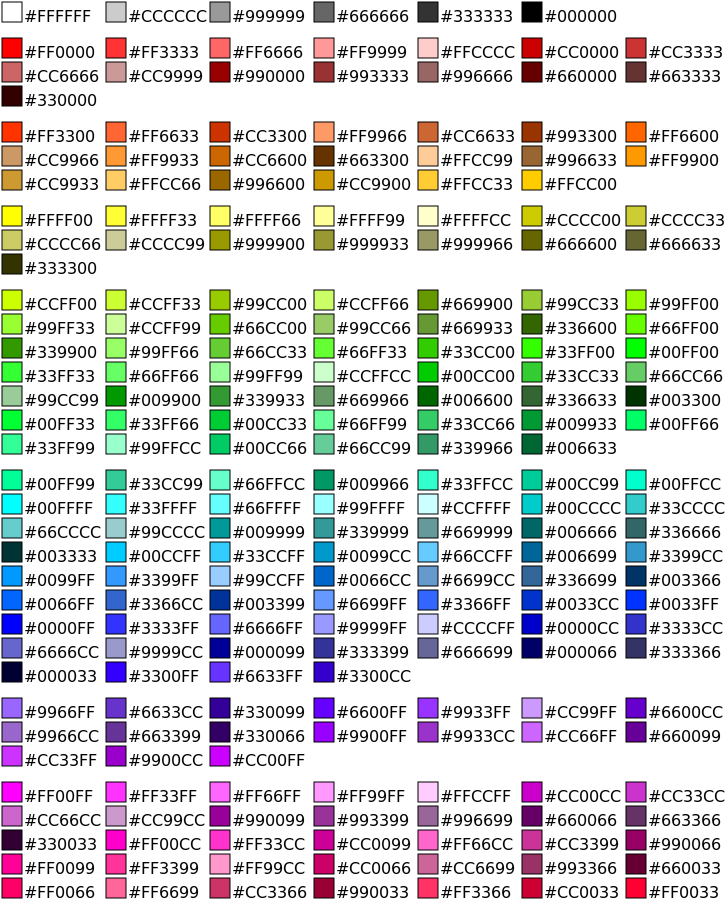

This page describes common identifiers and names for colors, as used in the HTML 3D Library's `toGLColor` method.

What Colors Can I Use?
-------

You can use values like the following.

* CSS color names: `red`, `blue`, `silver`, `fuchsia`, `darkslateblue`
* HTML &#8220;hex colors&#8221;: `#223344`,  `#234`, or `#223344FF` (See &#8220;What Is the Syntax for HTML Colors?&#8221;)
* RGB colors: `rgb(20,30,40)` (See &#8220;What Is an RGB Color?&#8221;, below.)
* HSL colors: `hsl(200,100%,50%)` (See &#8220;What Is an HSL Color?&#8221;, below.)
</ul>

See the [CSS3 Color Module section 4](http://www.w3.org/TR/css3-color/#colorunits) for more information about these color values. In addition, the newly-added name `rebeccapurple` can be used.

What Do Some Colors Look Like?
--------

Here is a list of useful colors sorted by hue or color tone.  This particular list was historically called the "Web safe" colors because it provided a decent selection of fall-back colors for 256-color displays, but this list is still useful because it's short yet gives you a variety of appropriate colors for most purposes.

What Is the Syntax for HTML Colors?
--------------

The notation used to name the colors in the preceding section is used in HTML to define colors. It&#8217;s also known as &#8220;hex colors&#8221;.

Take `#ff80cc` as an example. The color defined is a carnation pink. There are four parts to this example:

* The `#` identifies this word as a color.
* The `ff` is two letters and/or digits that show the red component of the color. This is a so-called hexadecimal number, or base-16 number. Each digit of this number can range from 0-9 and from A-F, with 0 being the lowest digit, and F being the highest digit. The highest two-digit value is 00, and the lowest two-digit value is FF (256).
* The `80` is a base-16 number showing the color&#8217;s green component.
* The `cc` is a base-16 number showing the color&#8217;s blue component.

The notation may also include an additional base-16 number, as in this example: `#ac80ccff`.  Here, the last `ff` shows the color's alpha component, which can range from 00, or "fully transparent", to FF, or "fully opaque".

It looks complicated at first, but I will now show a way to easily make your own colors in this notation.

How Do I Make HTML Colors?
---------

Look at the table below that shows some of the values possible for the red, green, and blue components of some colors.

    Red   00 10 20 30 40 50 60 70 80 90 A0 B0 C0 D0 E0 F0 FF
    Green 00 10 20 30 40 50 60 70 80 90 A0 B0 C0 D0 E0 F0 FF
    Blue  00 10 20 30 40 50 60 70 80 90 A0 B0 C0 D0 E0 F0 FF

Now, to make a custom color, you choose one value from the red row, one value from the green row, and one value from the blue row. Each value shows the intensity of the light that the color reflects. For example, a red value of 00 means that no red light is reflected, and a red value of FF means that red light is fully reflected.

If you choose the same value in all three rows, the result is black (if you choose 00), white (if you choose FF) or a shade of gray. This shows that red, green, and blue light are equally reflected.

After you choose the three values, combine them by writing the `#`, then the red value, then the green value, then the blue value. For example, if you choose `FF` for red, `A0` for green, and `00` for blue, write the resulting color (orange) like this: `#FFA000`.

What Are Some Common HTML Colors?
-----------

Now, what follows is a list of common colors that are possible by choosing a value in each row. See also the list of colors sorted by hue.

                 Red   Green Blue  Color
    Red          FF    00    00    #FF0000
    Orange       FF    A0    00    #FFA000
    Yellow       FF    80    00    #FF8000
    Bright Green 00    FF    00    #00FF00
    Dark Green   00    80    00    #008000
    Sky Blue     00    FF    FF    #00FFFF
    Blue         00    00    FF    #0000FF
    Purple       C0    00    FF    #CC00FF
    Hot Pink     FF    00    FF    #FF00FF
    Black        00    00    00    #000000
    White        FF    FF    FF    #FFFFFF
    Gray         80    80    80    #808080

How Do I Darken an HTML Color?
---------

To darken a color, use the table shown in &#8220;How Do I Make HTML Colors?&#8221;, above, and move each component (red, green, and blue) the same number of steps to the left. If you can&#8217;t move a component that far to the left, that component becomes 00.

For example, to make a darker sky blue, start with 00, FF, and FF for red, green, and blue. When we move these components ten steps to the left, we get 00, 60, and 60. The final color becomes #006060.

How Do I Lighten a HTML Color?
--------

Lightening a color is almost the same as darkening a color, except we move the same number of steps to the right rather than the left. If you can&#8217;t move a component that far to the right, that component becomes FF.

For example, to make a lighter red, start with FF, 00, and 00 for red, green, and blue. When we move these components ten steps to the right, we get FF, A0, and A0. The final color becomes #FFA0A0.

How Do I Desaturate an HTML Color?
-------

To make a desaturated (washed-out) version of a color, move the color components closer to each other, in about the same proportion. (If they&#8217;re exactly the same, the result is a shade of gray.)

For example, to make a washed-out red, start with FF, 00, and 00 for red, green, and blue. When we move these components closer to each other, we get C0, 40, and 40. The final color becomes #C04040.

What Is an RGB Color?
-------

An RGB color contains the same information as an HTML color, except that each value is shown in the familiar base-10 format.  For example, the value `rgb(192,64,0)` is the same as the HTML color value `#C04000`.  The steps for darkening, lightening, and desaturating RGB colors are pretty much the same as with HTML colors.

What Is an HSL Color?
-------

An HSL color is a color represented in the Hue-Saturation-Lightness color space.  Here&#8217;s what each component means in detail.

* Hue ranges from 0 to 360 degrees.  Each angle on the color wheel stands for a different hue:

    * Reds have hue 0 (say, 12 o&#8217;clock);
    * Yellows have hue 60 (2 o&#8217;clock);
    * Greens have hue 120 (4 o&#8217;clock);
    * Cyans (Sky-blues) have hue 180 (6 o&#8217;clock);
    * Blues have hue 240 (8 o&#8217;clock); and
    * Magentas have hue 300 (10 o&#8217;clock).

* **Saturation**, or vividness, ranges from 0% to 100%. 100% stands for the purest, most vivid color. The lower the number, the greater the amount of gray in the color.  0% means the color is completely gray.  Therefore, ***to desaturate a color***, simply lower the amount of saturation.

* **Lightness** is also a value ranging from 0% to 100%. It expresses the amount of black or white in the color. 0% means fully black, 100% means fully white, and 50% means the color contains neither black nor white.  ***To darken a color***, lower the lightness, and ***to lighten a color***, raise the lightness.

**Example:**

The value hsl(240,100%,50%) has a hue of 240 (blue), a saturation of 100% (fully saturated), and a lightness of 50% (neither black or white).  It represents a vivid blue.  If we lower lightness to 20%, we get a dark blue.  If we also change the hue to 0, we get a dark red.
